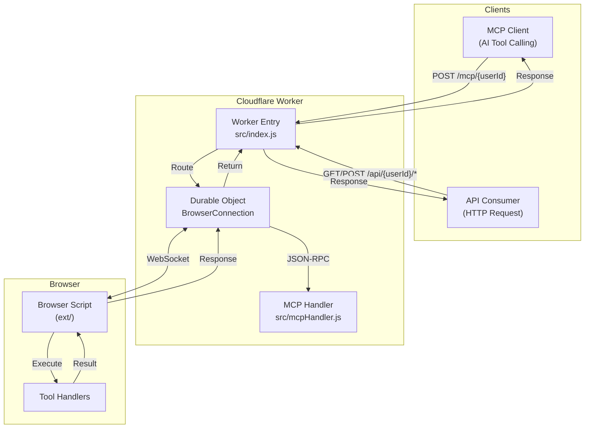

# Broxy Worker

[中文](./README.zh.md)

Broxy backend service built on Cloudflare Worker + Durable Objects. Provides WebSocket bridging, REST API proxy, and MCP (Model Context Protocol) support to expose browser capabilities as callable API services.

## Features

- **WebSocket Bridging** - Establish persistent connections with browser scripts for real-time communication
- **REST API Proxy** - Proxy requests to browsers via `/api/{userId}/*` endpoint
- **MCP Protocol Support** - Implements MCP JSON-RPC 2.0 protocol for AI tool calling
- **Durable Objects** - Per-user connection state management with long-lived connections and request queuing

## Architecture



## API Endpoints

### Health Check

```http
GET /health
```

Response:

```json
{
  "status": "ok",
  "service": "broxy",
  "endpoints": {
    "connect": "/connect?id={userId}",
    "mcp": "/mcp/{userId}",
    "api": "/api/{userId}/{route}"
  }
}
```

### WebSocket Connection

```http
GET /connect?id={userId}
Upgrade: websocket
```

Browser scripts establish WebSocket connections through this endpoint.

Connection success message:

```json
{
  "type": "connected",
  "connectionId": "uuid-xxx",
  "message": "Browser bridge connected successfully"
}
```

Request message (Worker → Browser):

```json
{
  "type": "request",
  "requestId": "uuid-xxx",
  "data": {
    "method": "GET",
    "path": "/api/route",
    "query": {},
    "headers": {},
    "body": null
  }
}
```

Response message (Browser → Worker):

```json
{
  "type": "response",
  "requestId": "uuid-xxx",
  "result": { "data": "response data" }
}
```

### REST API Proxy

All HTTP methods are supported:

```http
GET|POST|PUT|DELETE /api/{userId}/{route}
```

Request example:

```bash
curl -X POST https://your-worker.workers.dev/api/user123/data/fetch \
  -H "Content-Type: application/json" \
  -d '{"url": "https://example.com/api"}'
```

Success response:

```json
{
  "data": {
    "result": "browser execution result"
  }
}
```

Error response (browser not connected):

```json
{
  "error": "Browser not connected",
  "userId": "user123",
  "hint": "Browser script may not be running or userId is invalid"
}
```

Error response (timeout):

```json
{
  "error": "timeout",
  "userId": "user123",
  "details": "Browser did not respond within 30000ms"
}
```

### MCP JSON-RPC Endpoint

```http
POST /mcp/{userId}
Content-Type: application/json
```

Initialize request:

```json
{
  "jsonrpc": "2.0",
  "id": 1,
  "method": "initialize",
  "params": {
    "protocolVersion": "2025-03-26",
    "capabilities": {},
    "clientInfo": {
      "name": "my-client",
      "version": "1.0.0"
    }
  }
}
```

Initialize response:

```json
{
  "jsonrpc": "2.0",
  "id": 1,
  "result": {
    "protocolVersion": "2025-03-26",
    "capabilities": {
      "tools": {},
      "resources": {},
      "prompts": {}
    },
    "serverInfo": {
      "name": "Broxy MCP Server",
      "version": "1.0.0"
    }
  }
}
```

List tools:

```json
{
  "jsonrpc": "2.0",
  "id": 2,
  "method": "tools/list",
  "params": {}
}
```

Tools list response example:

```json
{
  "jsonrpc": "2.0",
  "id": 2,
  "result": {
    "tools": [
      {
        "name": "fetch_page",
        "description": "Fetch page content",
        "inputSchema": {
          "type": "object",
          "properties": {
            "url": { "type": "string" }
          },
          "required": ["url"]
        }
      }
    ]
  }
}
```

Call tool:

```json
{
  "jsonrpc": "2.0",
  "id": 3,
  "method": "tools/call",
  "params": {
    "name": "fetch_page",
    "arguments": {
      "url": "https://example.com"
    }
  }
}
```

Tool call response:

```json
{
  "jsonrpc": "2.0",
  "id": 3,
  "result": {
    "content": [
      {
        "type": "text",
        "text": "page content..."
      }
    ]
  }
}
```

## Local Development

```bash
npx wrangler dev
```

Development server starts at `http://localhost:8787` by default.

## Deployment

```bash
npx wrangler deploy
```

After successful deployment, the Worker URL will be output, e.g., `https://broxy.your-subdomain.workers.dev`.

## Configuration

`wrangler.toml` configuration:

```toml
name = "broxy"                    # Worker name
main = "src/index.js"             # Entry file
compatibility_date = "2024-01-01" # Compatibility date

# Durable Objects binding
[[durable_objects.bindings]]
name = "BROWSER_CONNECTIONS"      # Binding name (referenced in code)
class_name = "BrowserConnection"  # Durable Object class name

# Migration config (required for first deployment)
[[migrations]]
tag = "v1"
new_sqlite_classes = ["BrowserConnection"]

# Environment variables
[vars]
DEFAULT_TIMEOUT = "30000"         # Request timeout (milliseconds)
```

### Environment Variables

| Variable | Default | Description |
|----------|---------|-------------|
| `DEFAULT_TIMEOUT` | `30000` | Browser request timeout (milliseconds) |

## Directory Structure

```
worker/
├── src/
│   ├── index.js         # Main entry, route dispatching
│   ├── durableObject.js # Durable Object, browser connection management
│   └── mcpHandler.js    # MCP JSON-RPC protocol handler
└── wrangler.toml        # Cloudflare Worker configuration
```

## Related Projects

| Project | Description |
|---------|-------------|
| [ext/](../ext) | Browser extension/Tampermonkey script |
| [ext-ui/](../ext-ui) | Extension UI (React + TypeScript) |
| [www/](../www) | Static landing page |

## License

MIT
