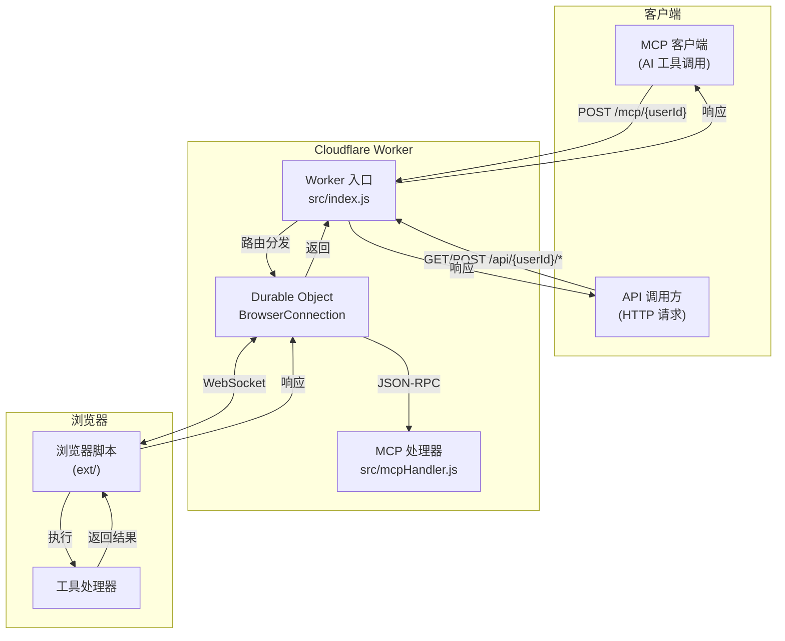

# Broxy Worker

[English](./README.md)

Broxy 后端服务，基于 Cloudflare Worker + Durable Objects 构建。提供 WebSocket 桥接、REST API 代理和 MCP (Model Context Protocol) 支持，将浏览器能力暴露为可调用的 API 服务。

## 功能特性

- **WebSocket 桥接** - 与浏览器脚本建立持久连接，实时通信
- **REST API 代理** - 通过 `/api/{userId}/*` 端点代理请求到浏览器执行
- **MCP 协议支持** - 实现 MCP JSON-RPC 2.0 协议，支持 AI 工具调用
- **Durable Objects** - 每个用户独立的连接状态管理，支持长连接和请求等待

## 架构



## API 端点

### 健康检查

```http
GET /health
```

响应示例：

```json
{
  "status": "ok",
  "service": "broxy",
  "endpoints": {
    "connect": "/connect?id={userId}",
    "mcp": "/mcp/{userId}",
    "api": "/api/{userId}/{route}"
  }
}
```

### WebSocket 连接

```http
GET /connect?id={userId}
Upgrade: websocket
```

浏览器脚本通过此端点建立 WebSocket 连接。

连接成功消息：

```json
{
  "type": "connected",
  "connectionId": "uuid-xxx",
  "message": "Browser bridge connected successfully"
}
```

请求消息（Worker → 浏览器）：

```json
{
  "type": "request",
  "requestId": "uuid-xxx",
  "data": {
    "method": "GET",
    "path": "/api/route",
    "query": {},
    "headers": {},
    "body": null
  }
}
```

响应消息（浏览器 → Worker）：

```json
{
  "type": "response",
  "requestId": "uuid-xxx",
  "result": { "data": "响应数据" }
}
```

### REST API 代理

所有 HTTP 方法均支持：

```http
GET|POST|PUT|DELETE /api/{userId}/{route}
```

请求示例：

```bash
curl -X POST https://your-worker.workers.dev/api/user123/data/fetch \
  -H "Content-Type: application/json" \
  -d '{"url": "https://example.com/api"}'
```

成功响应：

```json
{
  "data": {
    "result": "浏览器执行结果"
  }
}
```

错误响应（浏览器未连接）：

```json
{
  "error": "Browser not connected",
  "userId": "user123",
  "hint": "Browser script may not be running or userId is invalid"
}
```

错误响应（超时）：

```json
{
  "error": "timeout",
  "userId": "user123",
  "details": "Browser did not respond within 30000ms"
}
```

### MCP JSON-RPC 端点

```http
POST /mcp/{userId}
Content-Type: application/json
```

初始化请求：

```json
{
  "jsonrpc": "2.0",
  "id": 1,
  "method": "initialize",
  "params": {
    "protocolVersion": "2025-03-26",
    "capabilities": {},
    "clientInfo": {
      "name": "my-client",
      "version": "1.0.0"
    }
  }
}
```

初始化响应：

```json
{
  "jsonrpc": "2.0",
  "id": 1,
  "result": {
    "protocolVersion": "2025-03-26",
    "capabilities": {
      "tools": {},
      "resources": {},
      "prompts": {}
    },
    "serverInfo": {
      "name": "Broxy MCP Server",
      "version": "1.0.0"
    }
  }
}
```

获取工具列表：

```json
{
  "jsonrpc": "2.0",
  "id": 2,
  "method": "tools/list",
  "params": {}
}
```

工具列表示例响应：

```json
{
  "jsonrpc": "2.0",
  "id": 2,
  "result": {
    "tools": [
      {
        "name": "fetch_page",
        "description": "获取页面内容",
        "inputSchema": {
          "type": "object",
          "properties": {
            "url": { "type": "string" }
          },
          "required": ["url"]
        }
      }
    ]
  }
}
```

调用工具：

```json
{
  "jsonrpc": "2.0",
  "id": 3,
  "method": "tools/call",
  "params": {
    "name": "fetch_page",
    "arguments": {
      "url": "https://example.com"
    }
  }
}
```

工具调用响应：

```json
{
  "jsonrpc": "2.0",
  "id": 3,
  "result": {
    "content": [
      {
        "type": "text",
        "text": "页面内容..."
      }
    ]
  }
}
```

## 本地开发

```bash
npx wrangler dev
```

开发服务器启动后，默认监听 `http://localhost:8787`。

## 部署

```bash
npx wrangler deploy
```

部署成功后会输出 Worker URL，如 `https://broxy.your-subdomain.workers.dev`。

## 配置

`wrangler.toml` 配置说明：

```toml
name = "broxy"                    # Worker 名称
main = "src/index.js"             # 入口文件
compatibility_date = "2024-01-01" # 兼容性日期

# Durable Objects 绑定
[[durable_objects.bindings]]
name = "BROWSER_CONNECTIONS"      # 绑定名称（代码中引用）
class_name = "BrowserConnection"  # Durable Object 类名

# 迁移配置（首次部署需要）
[[migrations]]
tag = "v1"
new_sqlite_classes = ["BrowserConnection"]

# 环境变量
[vars]
DEFAULT_TIMEOUT = "30000"         # 请求超时时间（毫秒）
```

### 环境变量

| 变量名 | 默认值 | 说明 |
|--------|--------|------|
| `DEFAULT_TIMEOUT` | `30000` | 浏览器请求超时时间（毫秒） |

## 目录结构

```
worker/
├── src/
│   ├── index.js         # 主入口，路由分发
│   ├── durableObject.js # Durable Object，浏览器连接管理
│   └── mcpHandler.js    # MCP JSON-RPC 协议处理器
└── wrangler.toml        # Cloudflare Worker 配置
```

## 相关项目

| 项目 | 说明 |
|------|------|
| [ext/](../ext) | 浏览器扩展/Tampermonkey 脚本 |
| [ext-ui/](../ext-ui) | 扩展 UI（React + TypeScript） |
| [www/](../www) | 静态落地页 |

## 许可证

MIT
